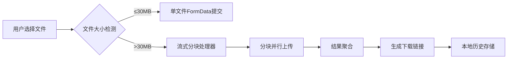

# FCD微型网盘 - 流式分块上传工具

[](https://www.gnu.org/licenses/gpl-3.0.html)
[](https://vuejs.org/)
[](https://vercel.com)

> 专为绕过大文件限制设计的智能分块上传系统，保障文件安全性与传输可靠性

---

## 核心功能

### 技术实现
- **分块上传**：基于浏览器流式API（`ReadableStream`），动态分块（每块≤20MB）
- **断点重传**：自动重试失败分块（最多3次，指数退避策略）
- **双模式支持**：
  - **单文件模式**：直接上传≤30MB文件（`uploadSingleFile`）
  - **分块模式**：流式切割大文件（`uploadChunks`）
- **本地持久化**：
  - 操作日志（`localStorage`存储，支持导出）
  - 上传历史（时间戳+链接，自动去重）

### 交互特性
- **实时状态监控**：
  - 分块统计（`总块数: {{ totalChunks }}`）
  - 预估完成时间（动态倒计时）
- **主题系统**：
  - 深色/浅色模式切换（`ThemeToggle.vue`）
  - Material Design 3风格（`styles.css`）
- **便捷操作**：
  - 链接一键复制（`navigator.clipboard`）
  - 文件合并下载（`Blob`流合并）

---

## 技术栈

| 模块          | 实现细节                                                                 |
|---------------|--------------------------------------------------------------------------|
| **前端框架**  | Vue 3 Composition API（`<script setup>`语法）                           |
| **网络请求**  | Fetch API + 自定义重试逻辑（`fetchWithRetry`）                          |
| **文件处理**  | Streams API（`file.value.stream().getReader()`）                        |
| **状态管理**  | Vue响应式系统（`ref`/`reactive`）                                       |
| **样式系统**  | CSS变量 + 深色模式适配（`darktheme.css`）                               |
| **构建工具**  | Vite 6（`package.json`配置）                                            |

---

## 快速使用

### 本地运行
```bash
# 从代码文件（package.json）
npm install
npm run dev
```
### Vercel一键部署
[](https://vercel.com/import/project?template=https://github.com/CJackHwang/Fuck-Codemao-Detection)


### 文件上传流程
1. **选择文件**：拖放或点击选择（`<input type="file">`）
2. **模式选择**：启用分块模式（`isChunkedMode`绑定）
3. **开始上传**：调用`uploadFile`方法
4. **获取链接**：结果存入`sjurl`并显示

### 其他操作
- **日志管理**：清除/导出操作记录（`debugOutput`）
- **历史记录**：查看/导出上传历史（`uploadHistory`）
- **主题切换**：点击月亮/太阳图标切换模式

---

## 核心配置

### 分块参数（MainContent.vue）
```javascript
const MAX_CHUNK_SIZE = 20 * 1024 * 1024; // 分块上限
const chunkSize = ref(0);                // 动态计算值
const totalChunks = ref(0);              // 总块数
```

### 网络参数（MainContent.vue）
```javascript
// 上传端点
const UPLOAD_URL = 'https://api.pgaot.com/user/up_cat_file';

// 重试策略（fetchWithRetry）
let retries = 3;
while (retries > 0) { ... }
```

### 主题配置（ThemeToggle.vue）
```javascript
// 本地存储主题状态
localStorage.setItem('theme', isDarkMode ? 'dark' : 'light');
document.documentElement.classList.toggle('dark-theme', isDarkMode);
```

---

## 数据流架构



---

## 合规声明

1. **许可证**：GPL-3.0（`package.json`声明）
2. **数据安全**：
   - 所有操作记录仅存于本地（`localStorage`）
   - 无远程数据收集
3. **使用限制**：
   - 禁止上传违法内容
   - 分块模式需手动启用

---

## 贡献指南

1. **代码规范**：
   - 遵循ESLint配置（`package.json`）
   - 使用Vue3 Composition API
2. **提交要求**：
   - 包含对应单元测试
   - 更新相关文档
3. **问题反馈**：通过GitHub Issues提交

---

**开发者信息**  
CJackHwang · [GitHub](https://github.com/CJackHwang) · [博客](http://www.cjack.cfd)

> 注意：本项目为技术演示用途，实际使用需遵守目标平台规则