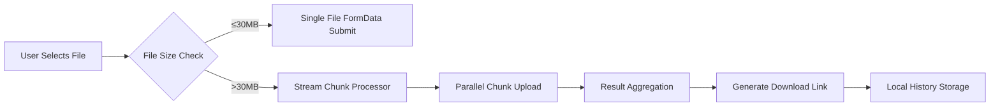

# FCD Micro Drive - Streamable Chunked Upload Tool  

[](https://www.gnu.org/licenses/gpl-3.0.html)  
[](https://vuejs.org/)  
[](https://vercel.com)  
**这里有中文版文档**：[README_CN.md](./README_CN.md)  

> A chunked upload utility designed to bypass Codemao's large file restrictions, ensuring reliable file transfers.  

---  

## Core Features  

### Technical Implementation  
- **Chunked Upload**: Browser Streams API (`ReadableStream`)-based dynamic chunking (≤20MB per chunk)  
- **Resumable Uploads**: Automatic retry for failed chunks (max 3 retries with exponential backoff)  
- **Dual Modes**:  
  - **Single File Mode**: Direct upload for ≤30MB files (`uploadSingleFile`)  
  - **Chunked Mode**: Stream-based splitting for large files (`uploadChunks`)  
- **Local Persistence**:  
  - Operation logs (`localStorage`, exportable)  
  - Upload history (timestamped URLs with deduplication)  

### Interactive Features  
- **Real-time Monitoring**:  
  - Chunk statistics (`Total Chunks: {{ totalChunks }}`)  
  - ETA calculation (dynamic countdown)  
- **Theme System**:  
  - Dark/Light mode toggle (`ThemeToggle.vue`)  
  - Material Design 3 styling (`styles.css`)  
- **Convenient Operations**:  
  - One-click URL copy (`navigator.clipboard`)  
  - File merging & download (`Blob` stream merging)  

---  

## Tech Stack  

| Module           | Implementation Details                                                                 |
|------------------|---------------------------------------------------------------------------------------|  
| **Frontend**     | Vue 3 Composition API (`<script setup>` syntax)                                       |  
| **Network**      | Fetch API + custom retry logic (`fetchWithRetry`)                                     |  
| **File Handling**| Streams API (`file.value.stream().getReader()`)                                       |  
| **State**        | Vue Reactivity System (`ref`/`reactive`)                                              |  
| **Styling**      | CSS Variables + dark mode adaptation (`darktheme.css`)                                |  
| **Build Tool**   | Vite 6 (`package.json` config)                                                        |  

---  

## Quick Start  

### Local Development  
```bash  
# From source (package.json)  
npm install  
npm run dev  
```  

### Vercel Deployment  
[](https://vercel.com/import/project?template=https://github.com/CJackHwang/Fuck-Codemao-Detection)  

### Upload Workflow  
1. **Select File**: Drag-and-drop or click (`<input type="file">`)  
2. **Choose Mode**: Enable chunked mode (`isChunkedMode` binding)  
3. **Start Upload**: Invoke `uploadFile` method  
4. **Get Link**: Result stored in `sjurl` and displayed  

### Additional Operations  
- **Log Management**: Clear/export logs (`debugOutput`)  
- **History**: View/export upload history (`uploadHistory`)  
- **Theme Toggle**: Click moon/sun icon to switch themes  

---  

## Core Configuration  

### Chunk Parameters (MainContent.vue)  
```javascript  
const MAX_CHUNK_SIZE = 20 * 1024 * 1024; // Chunk size limit  
const chunkSize = ref(0);                // Dynamically calculated  
const totalChunks = ref(0);              // Total chunks  
```  

### Network Parameters (MainContent.vue)  
```javascript  
// Upload endpoint  
const UPLOAD_URL = 'https://api.pgaot.com/user/up_cat_file';  

// Retry policy (fetchWithRetry)  
let retries = 3;  
while (retries > 0) { ... }  
```  

### Theme Configuration (ThemeToggle.vue)  
```javascript  
// Persist theme state  
localStorage.setItem('theme', isDarkMode ? 'dark' : 'light');  
document.documentElement.classList.toggle('dark-theme', isDarkMode);  
```  

---  

## Data Flow Architecture  



---  

## Compliance  

1. **License**: GPL-3.0 (declared in `package.json`)  
2. **Data Security**:  
   - All logs stored locally (`localStorage`)  
   - No remote data collection (open-source code)  
3. **Usage Restrictions**:  
   - Illegal content prohibited (cloud-side filtering)  
   - Chunked mode requires manual activation  

---  

## Contribution Guidelines  

1. **Code Standards**:  
   - Follow ESLint rules (`package.json`)  
   - Use Vue 3 Composition API  
2. **Commit Rules**:  
   - Include unit tests  
   - Update relevant documentation  
3. **Issue Reporting**: Submit via GitHub Issues  

---  

**Developer Info**  
CJackHwang · [GitHub](https://github.com/CJackHwang) · [Blog](http://www.cjack.cfd)  

> Note: This project is for technical demonstration. Actual usage must comply with target platform policies.  