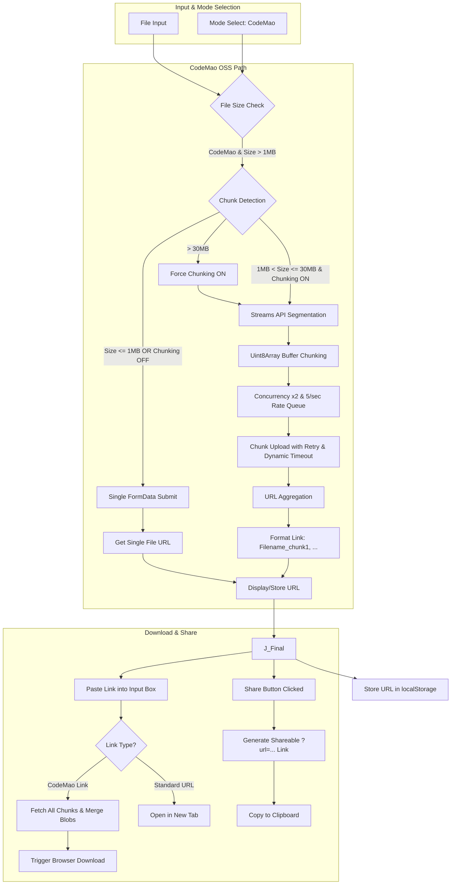

# Chunkuposs — 分块上传与分享工具 (v5.4+)

[](https://www.gnu.org/licenses/gpl-3.0.html)
[](https://vuejs.org/)
[](https://vercel.com)
**中文版本 (Chinese Version)**: [README_CN.md](./README_CN.md)

> Chunkuposs is a browser-based chunked uploader and sharer targeting the current CodeMao OSS API. The former DangBei OSS path is deprecated and hidden in UI; docs now reflect the active CodeMao implementation only.

---

## 🚀 Core Features (v5.4+)

### Technical Enhancements & New Features
- **Active target: CodeMao OSS**: Uploads use `https://api.pgaot.com/user/up_cat_file`.
- **Smart Chunking Strategy**: Dynamic calculation (1MB min / 15MB max), auto-disable for small files (≤1MB), buffer streaming segmentation.
- **Mandatory Chunking**: Automatically enforces and locks chunked upload for files > 30MB.
- **Advanced Concurrency & Rate Control**: Parallel limit (2), rate limit (≤5/sec).
- **Reliability Optimization**: Chunk retry with dynamic timeout and exponential backoff.
- **Enhanced Sharing**: Generate shareable links (`?url=...`) that pre-fill the download URL for recipients.
- **M3 Theming System**: Material Design 3 with Light/Dark modes via CSS variables.
- **Local Persistence**: Operation logs and upload history stored in `localStorage`.

### UX Improvements
- **Focused UI**: Only the CodeMao mode is exposed in UI (DangBei is removed/hidden).
- **Clear Status Monitoring**: Real-time chunk progress and ETA calculation.
- **History Integration**: Select past links from history to pre-fill the download input.
- **Toast Notifications**: Clear feedback for actions, errors, and forced settings (e.g., >30MB chunking).
- **Component Structure**: Refactored components (`DebugLogger`, `UploadHistory`, `ThemeToggle`) for clarity.

---

## 🛠️ Tech Stack

| Module              | Implementation Details                                                                 |
|---------------------|----------------------------------------------------------------------------------------|
| **UI & Styling**    | Material Design 3 (M3), CSS Custom Properties (Variables), Toastify.js                |
| **Network Layer**   | `fetch` + `AbortController` with dynamic timeouts (chunk-size based)                  |
| **File Handling**   | Streams API + Blob merging (browser memory optimized)                                 |
| **State Management**| Vue Reactivity System (`ref`, `computed`) + `localStorage` (auto JSON serialization) |
| **Error Handling**  | Three-layer error catching (network/business/user)                                    |
| **Build Optimization**| Vite (assumed) + Smart chunk splitting (vendor auto-separation)                       |

---

## 🖥️ Quick Start

### Deployment
```bash
# Local development (hot-reload)
npm install
npm run dev

# Production build (PWA support)
npm run build
```

### Vercel One-Click Deploy
[](https://vercel.com/new/clone?repository-url=https://github.com/CJackHwang/Chunkuposs)

### Workflow
1. **Select File**: Drag & drop or click to select.
2. **Upload**: Click "上传文件".
3. **Monitor**: Observe real-time status updates and progress.
4. **Get Link**: Upon success, the shareable link appears. For chunked uploads, the link format is `[filename]chunk1,chunk2,...`.
5. **Download (Optional)**: Paste a chunked link or standard URL and click "下载文件".
6. **Share (Optional)**: Click "分享文件" to copy a URL containing the current link for easy sharing.

---

## ⚙️ Core Configurations & Logic

### CodeMao Network (MainContent.vue)
```javascript
const UPLOAD_URL = 'https://api.pgaot.com/user/up_cat_file'; // Codemao upload endpoint
const REQUEST_RATE_LIMIT = 5;  // Max requests/sec
const CONCURRENT_LIMIT = 2;    // Parallel chunks
const MAX_CHUNK_SIZE = 15 * 1024 * 1024; // 15MB max chunk
const MIN_CHUNK_SIZE = 1 * 1024 * 1024;  // 1MB min chunk (below this, single upload)
const THIRTY_MB_THRESHOLD = 30 * 1024 * 1024; // Files > this force chunking
```

### DangBei Path (Deprecated)
- The previous DangBei OSS integration is no longer functional and has been removed/hidden in the UI. The service file may exist historically but should not be relied upon.

### Key Logic Snippets (MainContent.vue)
```javascript
// Force chunking > 30MB (in updateFileInfo & watch uploadMode)
if (uploadMode.value === 'codemao' && fileSize > THIRTY_MB_THRESHOLD) {
    isLargeFileSupport.value = true; // Force enable
    isChunkCheckboxDisabled.value = true; // Disable checkbox
}

// Share Link Generation (in handleShare)
const currentUrl = new URL(window.location.href);
currentUrl.search = ''; // Clear existing params
currentUrl.searchParams.set('url', encodeURIComponent(sjurl.value));
const shareUrl = currentUrl.toString();
helpers.copyToClipboard(shareUrl, ...);
```

---

## 📊 System Architecture (v5.4+)



---

## 🔒 Compliance & Security

1. **Data Privacy**:
   - All operation logs and history are stored solely in the browser's `localStorage`.
   - No third-party tracking or analytics SDKs are embedded (pure frontend implementation).
2. **Provider Policies**:
   - Upload results are subject to the upstream storage provider’s policies and moderation.
3. **Licensing**:
   - The project codebase is licensed under GPL-3.0.
   - Commercial use of this tool, especially leveraging CodeMao's non-public APIs, is prohibited.

---

## 🧩 Components (v5.4+)

| Component             | Features                                                                    |
|-----------------------|-----------------------------------------------------------------------------|
| `MainContent.vue`     | Core logic: Mode switching, file handling, upload/download orchestration.   |
| 已移除 DangBei 相关代码 | 历史遗留服务与分支已清理，避免误用。                                      |
| `DebugLogger.vue`     | Real-time log display (timestamped), export/clear functionality.            |
| `UploadHistory.vue`   | Displays history table (M3 themed), allows selecting links to fill input. |
| `ThemeToggle.vue`     | M3 theme switching button (system preference detection, manual override).   |
| `toast.js` (Service)  | Provides user feedback via Toastify.js notifications.                       |
| `helpers.js` (Utils)  | Utility functions (clipboard copy, file download trigger, reset).           |
| `storageHelper.js` (Utils)| Manages `localStorage` for logs and history.                            |

---

## 🤝 Contribution Guide

1. **Coding Standards**:
   - Adhere to Vue3 `<script setup>` syntax conventions.
   - Use `ref`/`computed` for reactive state management.
   - Employ clear function naming and appropriate comments.
2. **Testing Requirements**:
   - Test chunking logic with various file sizes (including >100MB).
   - Simulate slow network conditions and network errors using browser dev tools.
3. **Documentation**:
   - Update the README if core configurations are modified or new features are added.
   - Add new components to the "Components" section.

---

**Developer Info**
CJackHwang · [GitHub](https://github.com/CJackHwang) · [Tech Blog](http://www.cjack.cfd)

> Important Note: This tool is intended for technical research and convenient file sharing. Before uploading any file, ensure you have the necessary rights or authorization and comply with relevant laws, regulations, and platform policies.
