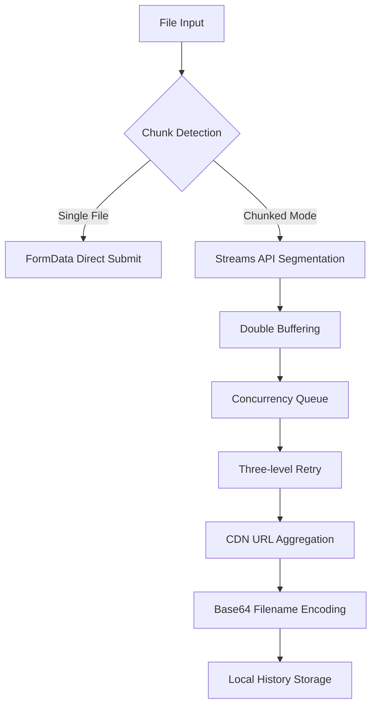

# FlowChunkFlex - Stream Chunked Upload Tool

[](https://www.gnu.org/licenses/gpl-3.0.html)
[](https://vuejs.org/)
[](https://vercel.com)
**中文版本**: [README_CN.md](./README_CN.md)

> A chunked upload tool designed to bypass large file limitations on CodeMao, ensuring reliable file transfer (v5.2+)

---

## 🚀 Core Features (v5.2+)

### Technical Enhancements
- **Smart Chunking Strategy**:
  - Dynamic chunk calculation (1MB min / 15MB max)
  - Auto-disable chunking for small files (≤1MB)
  - Buffer streaming segmentation (Uint8Array optimized)
- **Advanced Concurrency Control**:
  - Parallel upload limit (2 concurrent requests max)
  - Dynamic request rate control (≤5 requests/sec)
- **Reliability Optimization**:
  - Chunk retry with dynamic timeout (5s~60s)
  - Three-level retry mechanism (exponential backoff: 1s/2s/4s)
  - Real-time concurrency counter (`activeUploads` tracking)
- **Local Persistence**:
  - Paginated operation logs (1000 entries max)
  - Upload history deduplication (link hash-based)

### UX Improvements
- **Enhanced Status Monitoring**:
  - Real-time chunk progress (e.g., `Uploaded ${index}/${totalChunks} chunks`)
  - ETA calculation (based on historical speeds)
- **Component Refactoring**:
  - Independent debug logger (clear/export support)
  - Dark mode for history table
  - Theme transition animations (CSS variables)

---

## 🛠️ Tech Stack

| Module              | Implementation Details                                                                 |
|---------------------|----------------------------------------------------------------------------------------|
| **Network Layer**   | `AbortController` + Dynamic timeout (chunk size-based)                                |
| **File Handling**   | Streams API + Blob merging (browser memory optimized)                                 |
| **State Management**| Vue Reactivity System + `localStorage` (auto JSON serialization)                       |
| **Error Handling**  | Three-layer error catching (network/business/user)                                    |
| **Build Optimization**| Vite 6 + Smart chunk splitting (vendor auto-separation)                              |

---

## 🖥️ Quick Start

### Deployment
```bash
# Local development (hot-reload)
npm install
npm run dev

# Production build (PWA support)
npm run build
```

### Vercel One-Click Deploy
[](https://vercel.com/new/clone?repository-url=https://github.com/CJackHwang/FlowChunkFlex)

### Workflow
1. **File Selection**: Drag & drop with hover feedback (30MB max)
2. **Mode Toggle**: Auto chunking (enabled for files >1MB)
3. **Upload Monitoring**:
   - Real-time chunk progress
   - Server response metrics (visible in debug logs)
4. **Result Handling**:
   - Smart URL parsing (supports `[filename]chunk1,chunk2` format)
   - Browser stream merging (auto CDN path assembly)

---

## ⚙️ Core Configurations

### Network Layer (MainContent.vue)
```javascript
const UPLOAD_URL = 'https://api.pgaot.com/user/up_cat_file'; // Upload endpoint
const REQUEST_RATE_LIMIT = 5;  // Max requests per second
const CONCURRENT_LIMIT = 2;    // Parallel upload threads (actual code value)
const MAX_CHUNK_SIZE = 15 * 1024 * 1024; // Max chunk size 15MB
```

### Chunking Strategy (MainContent.vue)
```javascript
// Dynamic timeout calculation (chunk size-based)
const dynamicTimeout = Math.max(5000, (chunk.size / (20 * 1024 * 1024)) * 60000);

// Buffer management
let buffer = new Uint8Array(CHUNK_SIZE);
let bufferPos = 0; // Current buffer write position
```

---

## 📊 System Architecture (v5.2+)



---

## 🔒 Compliance & Security

1. **Data Privacy**:
   - All logs stored in `localStorage` only
   - No third-party SDKs (pure frontend implementation)
2. **Content Moderation**:
   - Follows CodeMao CDN policies
   - Illegal content auto-blocking (server-side)
3. **Licensing**:
   - GPL-3.0 Open Source License (includes dependencies)
   - Commercial use prohibited (CodeMao API restrictions)

---

## 🧩 Components (v5.2)

| Component           | Features                                                                 |
|---------------------|--------------------------------------------------------------------------|
| `DebugLogger.vue`   | Real-time logs (timestamp + separators)                                 |
| `UploadHistory.vue` | Virtual-scrolling table (500px max height)                              |
| `MainContent.vue`   | Core processor (streaming + concurrency control)                        |
| `ThemeToggle.vue`   | Theme synchronization (auto system theme detection)                     |

---

## 🤝 Contribution Guide

1. **Coding Standards**:
   - Use Vue3 `<script setup>` syntax
   - Reactive variables must use `ref`/`computed`
2. **Testing Requirements**:
   - Chunk logic requires >100MB file tests
   - Network error simulation (Chrome DevTools)
3. **Documentation**:
   - Sync README when modifying configurations
   - New components require documentation updates

---

**Developer Info**  
CJackHwang · [GitHub](https://github.com/CJackHwang) · [Tech Blog](http://www.cjack.cfd)

> Important: This tool is for technical research only. Ensure legal authorization before uploading files.