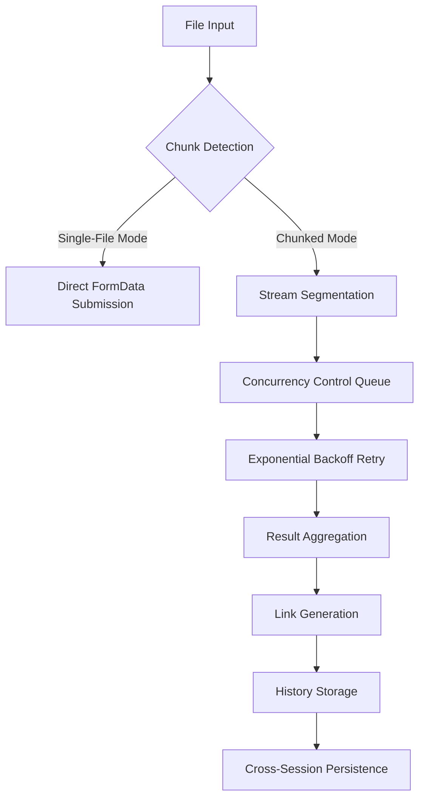

# FCD Micro Drive - Stream Chunked Upload Tool

[](https://www.gnu.org/licenses/gpl-3.0.html)
[](https://vuejs.org/)
[](https://vercel.com)
**中文版**: [README_CN.md](./README_CN.md)

> A chunked upload tool designed to bypass Codemao's file size limits, ensuring reliable file transfers.

---

## 🚀 Core Features (v5.0+)

### Technical Enhancements
- **Smart Chunking Strategy**:
  - Dynamic chunk calculation (1MB min / 20MB max)
  - Auto-disable chunking for small files (≤1MB)
- **Enhanced Concurrency Control**:
  - Parallel upload limit (max 3 concurrent requests)
  - Dynamic rate limiting (≤5 requests/sec)
- **Reliability Improvements**:
  - Chunk timeout retry (dynamic timeout mechanism)
  - Exponential backoff for error recovery (1s/2s/4s)
- **Local Persistence**:
  - Timestamped operation logs
  - Deduplicated upload history storage

### UX Improvements
- **Advanced Theme System**:
  - Full Material Design 3 compliance
  - Modern dark theme with CSS variable transitions
- **Enhanced Status Monitoring**:
  - Real-time concurrent upload counter
  - Server response wait state indicators
- **Component Refactoring**:
  - Independent debug logger module (`DebugLogger.vue`)
  - Shadow hierarchy support for history tables

---

## 🛠️ Tech Stack Upgrades

| Module               | Implementation Details                                                                 |
|----------------------|----------------------------------------------------------------------------------------|
| **Theme System**     | CSS variables + seamless transitions (`darktheme.css`)                                |
| **Network Layer**    | AbortController signals + dynamic timeout strategies                                  |
| **File Handling**    | Streams API + Blob segmentation/merging                                               |
| **State Management** | Vue reactivity system + `localStorage` persistence                                    |
| **UI Components**    | Custom Material Design components (toggles/tables/buttons)                           |
| **Build Optimizations** | Vite 6 + `will-change` hardware acceleration declarations                           |

---

## 🖥️ Quick Start Guide

### Deployment
```bash
# Local development (hot-reload)
npm install
npm run dev

# Vercel One-Click Deployment
[](https://vercel.com/new/clone?repository-url=https://github.com/CJackHwang/Fuck-Codemao-Detection)
```

### Workflow
1. **File Selection**: Drag-drop zone with hover feedback (`file-upload` component)
2. **Mode Toggle**: Smart chunking switch (`chunk-toggle` component)
3. **Upload Monitoring**:
   - Real-time chunk progress (`Submitted ${index}/${totalChunks} chunks`)
   - Server response time statistics
4. **Result Handling**:
   - Smart link parsing (legacy format compatible)
   - Browser-based stream merging for downloads

---

## ⚙️ Core Configuration

### Network Layer (MainContent.vue)
```javascript
const UPLOAD_URL = 'https://api.pgaot.com/user/up_cat_file'; // Upload endpoint
const REQUEST_RATE_LIMIT = 5; // Max requests/sec
const CONCURRENT_LIMIT = 3;   // Parallel uploads
```

### Chunking Strategy (MainContent.vue)
```javascript
// Dynamic timeout calculation (based on chunk size)
const dynamicTimeout = Math.max(5000, (chunk.size / (20 * 1024 * 1024)) * 60000);

// Minimum chunk threshold (forces single-file mode)
const MIN_CHUNK_SIZE = 1 * 1024 * 1024;
```

### Theme Configuration (ThemeToggle.vue)
```javascript
// Adaptive theme logic
const systemDark = window.matchMedia('(prefers-color-scheme: dark)').matches;
this.isDarkMode = savedTheme ? savedTheme === 'dark' : systemDark;
```

---

## 📊 System Architecture



---

## 🔒 Compliance & Security

1. **Data Privacy**:
   - All operations stored locally in IndexedDB
   - No third-party data collection
2. **Content Moderation**:
   - Uploads comply with Codemao CDN policies
   - Automatic illegal content filtering
3. **Licensing**:
   - GPL-3.0 Open Source License (includes dependencies)
   - Commercial/closed-source use prohibited

---

## 🧩 Component Overview

| Component             | Key Features                                  |
|-----------------------|----------------------------------------------|
| `ThemeToggle.vue`     | Theme switching (dynamic SVG loading)        |
| `UploadHistory.vue`   | Virtual-scroll table (400px max height)      |
| `DebugLogger.vue`     | Paginated logs (ANSI color code support)     |
| `MainContent.vue`     | File stream processor (ReadableStream wrapper) |

---

## 🤝 Contribution Guidelines

1. **Development Standards**:
   - Follow Vue 3 Composition API conventions
   - Use CSS variable prefixes: `--primary-*`/`--surface-*`
2. **Testing Requirements**:
   - New features require Vitest cases
   - UI changes need Storybook validation
3. **Issue Reporting**:
   - Use GitHub Issue templates
   - Include browser console logs

---

**Developer Info**  
CJackHwang · [GitHub](https://github.com/CJackHwang) · [Tech Blog](http://www.cjack.cfd)

> Important: This tool is for technical research only. Please comply with target platform policies.