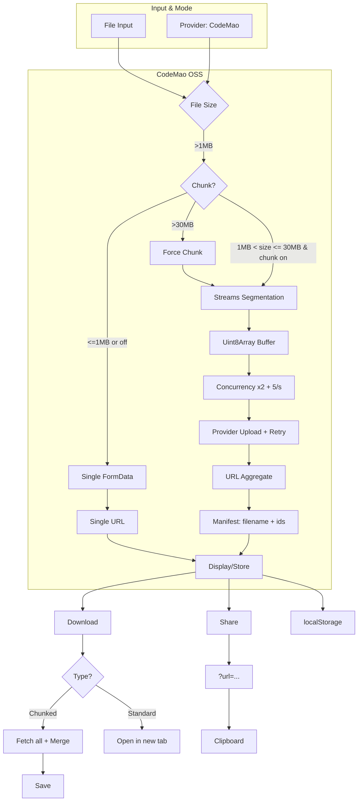

# Chunkuposs — Chunked Upload & Sharing (v6.0+)

[](https://www.gnu.org/licenses/gpl-3.0.html)
[](https://vuejs.org/)
[](https://vercel.com)
[](https://nodejs.org/)
[](https://www.npmjs.com/)
[](https://vitejs.dev/)
[](https://www.typescriptlang.org/)
English | 中文: [README_CN.md](README_CN.md)

Chunkuposs is a browser-based chunked uploader and sharer built on a Provider architecture (default: CodeMao). Core services are implemented in TypeScript. DangBei integration has been removed.

## What’s New in 6.0+
- Provider-injected service layer finalized (`StorageProvider` + `CodemaoProvider`).
- TypeScript for core services (upload/chunk/download/toast/storage).
- Forced chunking for >30 MB in CodeMao mode; dynamic 1–15 MB chunk sizing.
- Streaming segmentation with concurrency control (2 uploads, ≤5 req/s).
- Download concurrency (default 4) with progress indicator.
- Smarter ETA, dynamic timeouts, retries and robust logs.
- Share links via `?url=...` and auto-parse on load; history unified.
- Vite 7 + PWA plugin; Vue DevTools plugin ready.

## Core Features
- Provider architecture: `StorageProvider` + `CodemaoProvider` default.
- TS service layer: `uploadService.ts`, `chunkUploadService.ts`, `downloadService.ts`, `toast.ts`, `storageHelper.ts`.
- Smart chunking: 1–15 MB dynamic; >30 MB forced chunking; streaming segmentation.
- Concurrency & rate limits: upload concurrency 2 and ≤5 req/s; download concurrency 4 with a progress bar.
- Reliability: dynamic timeouts, retries, ETA improvements.
- Sharing & history: `?url=...` share link, unified local history and logs.

## Tech Stack
- UI & styling: Vue 3, CSS variables, Toastify.js, Material Design 3 theme.
- Network: `fetch` + `AbortController`; provider-driven endpoints.
- File handling: Streams API + Blob merging (optimized for browser memory).
- State: Vue reactivity (`ref`, `computed`) + `localStorage` persistence.
- Build: Vite 7 + PWA plugin, vendor chunk splitting.

Versions (current)
- Vite 7.1.x, @vitejs/plugin-vue 6.0.x, vite-plugin-pwa 1.0.x
- Vue 3.5.x, TypeScript 5.9.x, vue-tsc 3.x
- ESLint 9.x, Oxlint 1.x

## Prerequisites
- Node.js >=20 (recommended: 22)
- npm >=10 (or pnpm/yarn; scripts shown use npm)
- Modern browser with Streams API support
- Environment is declared in `package.json` via `engines` and `packageManager`.

## Quick Start
- Dev: `npm install`, `npm run dev`
- Build: `npm run build`
- Preview: `npm run preview`

### Scripts
- `npm run dev`: Start Vite dev server
- `npm run build`: Type-check + build (PWA support)
- `npm run preview`: Preview production build
- `npm run type-check`: Run `vue-tsc`
- `npm run lint`: Run both ESLint and Oxlint
- `npm run lint:eslint`: ESLint fix
- `npm run lint:oxlint`: Oxlint fix

### Environment variables (`.env`/`.env.local`)
```
VITE_UPLOAD_URL=https://api.pgaot.com/user/up_cat_file
VITE_REQUEST_RATE_LIMIT=5
VITE_CONCURRENT_LIMIT=2
VITE_MAX_CHUNK_MB=15
VITE_MIN_CHUNK_MB=1
VITE_FORCE_CHUNK_MB=30
VITE_BASE_DOWNLOAD_URL=https://static.codemao.cn/Chunkuposs/
VITE_FORM_UPLOAD_PATH=Chunkuposs
VITE_DOWNLOAD_CONCURRENT_LIMIT=4
```

Notes:
- `VITE_FORCE_CHUNK_MB` enforces chunk mode above this size in CodeMao mode.
- `VITE_BASE_DOWNLOAD_URL` is used to reconstruct chunk download URLs.
- All values have sane defaults defined in `src/config/constants.js`.

Vercel one‑click deploy:
[](https://vercel.com/new/clone?repository-url=https://github.com/CJackHwang/Chunkuposs)

## Usage Workflow
- Select file → Upload
- Monitor progress (chunked or single link)
- Get link: chunked format `[filename]chunk1,chunk2,...` or single URL
- Download: paste chunked link or standard URL
- Share: copy `?url=...` link

## Config & Provider
- Core constants: upload URL, rate/conc limits, chunk thresholds, base download URL, form upload path.
- Provider layer:
  - `src/providers/StorageProvider.ts`: `uploadSingle`, `uploadChunk`, `buildChunkManifest`, `getDownloadBase`
  - `src/providers/CodemaoProvider.ts`: default CodeMao implementation

### Link Formats
- Single URL (<=1 MB or manual single): `https://.../path/file.ext`
- Chunked manifest: `[filename]id1,id2,id3`
  - `filename` is URL-encoded; ids are extracted from provider upload responses.

### Key logic snippets (MainContent.vue)
```
// Force chunking > 30MB
if (uploadMode.value === 'codemao' && fileSize > THIRTY_MB_THRESHOLD) {
  isLargeFileSupport.value = true;
  isChunkCheckboxDisabled.value = true;
}

// Share link generation
const currentUrl = new URL(window.location.href);
currentUrl.search = '';
currentUrl.searchParams.set('url', encodeURIComponent(sjurl.value));
const shareUrl = currentUrl.toString();
```

## Architecture


## How Chunking Works
- File is read via `ReadableStream` and buffered into `Uint8Array` chunks.
- Concurrency is limited to 2, with an additional global ≤5 req/s rate cap.
- Each chunk upload has dynamic timeout and retry with exponential backoff.
- On completion, chunk ids are aggregated to `[filename]id1,id2,...`.
- Download uses concurrent GETs (default 4), merges Blobs and triggers save.

## Project Structure
- `src/components/MainContent.vue`: UI state + service calls
- `src/services/*`: upload (single/chunk), download, ETA, toast
- `src/providers/*`: provider interface and default CodeMao implementation
- `src/config/constants.*`: runtime config with env overrides
- `src/utils/*`: helpers and localStorage management
- `vite.config.ts`: Vite + PWA configuration

## PWA
- Manifest configured (name/icons/theme); standalone display.
- Runtime caching for common static assets; dev PWA enabled for testing.

## Limitations & Notes
- Upstream provider policies apply; links may be moderated or expire.
- Very large files depend on browser memory and network stability.
- Commercial use against non‑public APIs is prohibited.

## Security & License
- Data privacy: logs and history are stored only in browser `localStorage`.
- Provider policies: uploads follow upstream provider rules.
- License: GPL‑3.0; commercial use with non‑public APIs is prohibited.

## Components & Services
- Components: `MainContent.vue`, `DebugLogger.vue`, `UploadHistory.vue`, `ThemeToggle.vue`.
- Services (TS): `uploadService.ts`, `chunkUploadService.ts`, `downloadService.ts`, `toast.ts`.
- Utils: `helpers.js`, `storageHelper.ts`.
- Providers: `StorageProvider.ts`, `CodemaoProvider.ts`, `providers/index.ts`.

## Contribution
- Follow Vue 3 `<script setup>` conventions; use `ref`/`computed`.
- Test with various sizes (incl. >100MB); simulate slow networks.
- Keep docs updated when configs/features change.

## FAQ
- Why chunking forced above 30 MB? To improve reliability and avoid upstream single‑upload limits.
- Can I add another provider? Implement `StorageProvider` and swap in `getDefaultProvider()`.
- Why a manifest link format? It’s compact and provider‑agnostic; the app reconstructs download URLs.

## Roadmap
- See `ROADMAP.md` for bilingual roadmap and progress.

**Developer Info**
CJackHwang · [GitHub](https://github.com/CJackHwang) · [Tech Blog](http://www.cjack.cfd)

> Important Note: This tool is intended for technical research and convenient file sharing. Before uploading any file, ensure you have the necessary rights or authorization and comply with relevant laws, regulations, and platform policies.
