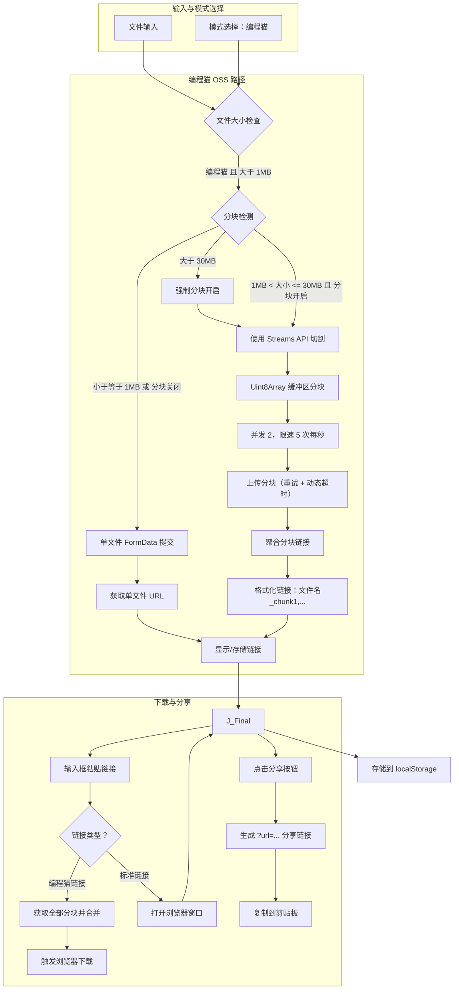

# Chunkuposs — 分块上传与分享工具 (v5.4+)

[](https://www.gnu.org/licenses/gpl-3.0.html)
[](https://vuejs.org/)
[](https://vercel.com)
**英文版本 (English Version)**: [README.md](./README.md)

> Chunkuposs 是一个基于浏览器的分块上传与分享工具，当前仅对接编程猫 OSS 接口。原当贝 OSS 路径已失效并在界面中隐藏，文档现仅覆盖编程猫实现。

---

## 🚀 核心功能（v5.4+）

### 技术特性
- **当前目标：编程猫 OSS**：使用 `https://api.pgaot.com/user/up_cat_file` 上传。
- **智能分块策略**：动态计算（最小 1MB / 最大 15MB），≤1MB 自动禁用分块，流式缓冲区切割。
- **强制分块**：文件 >30MB 自动强制启用并锁定分块上传。
- **并发与限流**：并行限制 2，速率限制 ≤5 次/秒。
- **可靠性优化**：分块重试（动态超时）与指数退避。
- **分享增强**：生成带 `?url=...` 的分享链接，便于接收方直接填充。
- **M3 主题系统**：Material Design 3，CSS 变量支持亮/暗模式。
- **本地持久化**：操作日志与上传历史保存在 `localStorage`。

### 交互体验
- **聚焦 UI**：界面仅保留编程猫模式（当贝已移除/隐藏）。
- **清晰状态监控**：实时显示分块进度与剩余时间预估。
- **历史记录整合**：可点击历史条目填充下载输入框。
- **Toast 提醒**：操作、错误与强制设定（如 >30MB 强制分块）有明确提示。
- **组件化结构**：`DebugLogger`、`UploadHistory`、`ThemeToggle` 等组件更清晰。

---

## 🛠️ 技术栈

| 模块                | 实现细节                                                                 |
|---------------------|--------------------------------------------------------------------------|
| **UI & 样式**       | Material Design 3 (M3) 规范, CSS 自定义属性 (变量), Toastify.js         |
| **网络层**          | `fetch` + `AbortController`（基于分块大小的动态超时）                    |
| **文件处理**        | Streams API + Blob分段合并（浏览器内存优化）                            |
| **状态管理**        | Vue响应式系统 (`ref`, `computed`) + localStorage持久化（自动JSON序列化） |
| **错误处理**        | 三级错误捕获（网络层/业务层/用户层）                                    |
| **构建优化**        | Vite (假设) + 智能分包策略（vendor包自动分离）                           |

---

## 🖥️ 快速使用指南

### 部署方式
```bash
# 本地开发（热重载支持）
npm install
npm run dev

# 生产构建（PWA支持）
npm run build
```

### 环境变量（可选）
在 `.env`/`.env.local` 中覆盖默认配置：
```
VITE_UPLOAD_URL=https://api.pgaot.com/user/up_cat_file
VITE_REQUEST_RATE_LIMIT=5
VITE_CONCURRENT_LIMIT=2
VITE_MAX_CHUNK_MB=15
VITE_MIN_CHUNK_MB=1
VITE_FORCE_CHUNK_MB=30
VITE_BASE_DOWNLOAD_URL=https://static.codemao.cn/Chunkuposs/
VITE_FORM_UPLOAD_PATH=Chunkuposs
VITE_DOWNLOAD_CONCURRENT_LIMIT=4
```

### Vercel 一键部署
[](https://vercel.com/new/clone?repository-url=https://github.com/CJackHwang/Chunkuposs)

### 工作流程
1. **选择文件**：拖放或点击选择。
2. **上传**：点击“上传文件”。
3. **监控**：观察实时状态与进度。
4. **获取链接**：成功后生成可分享链接。分块上传的链接格式为 `[文件名]块1,块2,...`。
5. **下载（可选）**：粘贴分块链接或标准 URL 后点击“下载文件”。
6. **分享（可选）**：点击“分享文件”复制包含当前链接的 URL。

---

## ⚙️ 核心配置与逻辑

### 编程猫网络配置 (MainContent.vue)
```javascript
const UPLOAD_URL = 'https://api.pgaot.com/user/up_cat_file'; // 编程猫上传端点
const REQUEST_RATE_LIMIT = 5;  // 每秒最大请求数
const CONCURRENT_LIMIT = 2;    // 并行分块数
const MAX_CHUNK_SIZE = 15 * 1024 * 1024; // 最大分块 15MB
const MIN_CHUNK_SIZE = 1 * 1024 * 1024;  // 最小分块 1MB (小于此值则单文件上传)
const THIRTY_MB_THRESHOLD = 30 * 1024 * 1024; // 文件大于此阈值强制分块
```

### 当贝路径（已废弃）
- 旧版当贝 OSS 集成已不可用，且在界面中移除/隐藏。服务文件可能仍在仓库中，但不应再使用。

### 关键逻辑片段 (MainContent.vue)
```javascript
// 大于 30MB 强制分块 (位于 updateFileInfo 及 watch uploadMode 中)
if (uploadMode.value === 'codemao' && fileSize > THIRTY_MB_THRESHOLD) {
    isLargeFileSupport.value = true; // 强制启用
    isChunkCheckboxDisabled.value = true; // 禁用复选框
}

// 生成分享链接 (位于 handleShare 中)
const currentUrl = new URL(window.location.href);
currentUrl.search = ''; // 清除现有参数
currentUrl.searchParams.set('url', encodeURIComponent(sjurl.value));
const shareUrl = currentUrl.toString();
helpers.copyToClipboard(shareUrl, ...);
```

---

## 📊 系统架构（v5.4+）



---

## 🔒 合规与安全

1. **数据隐私**：
   - 所有操作记录仅存储于浏览器 `localStorage`
   - 无第三方跟踪或分析 SDK 嵌入（纯前端实现）
2. **服务方策略**：
   - 上传结果受上游存储服务的策略与审核影响。
3. **许可协议**：
   - 项目代码基于 GPL-3.0 开源协议
   - 禁止将此工具及其使用的编程猫非公开 API 用于商业闭源项目

---

## 🧩 组件说明（v5.4+）

| 组件/服务             | 功能特性                                                                    |
|-----------------------|-----------------------------------------------------------------------------|
| `MainContent.vue`     | 核心逻辑: 模式切换, 文件处理, 上传/下载流程编排。                           |
| 已移除 DangBei 相关代码 | 历史遗留服务与分支已清理，避免误用。                                       |
| `DebugLogger.vue`     | 实时日志显示 (带时间戳), 导出/清除功能。                                    |
| `UploadHistory.vue`   | 显示历史记录表格 (M3 主题), 支持点击链接填充输入框。                        |
| `ThemeToggle.vue`     | M3 主题切换按钮 (检测系统偏好, 手动覆盖)。                                  |
| `toast.js` (服务)     | 通过 Toastify.js 提供用户反馈通知。                                         |
| `helpers.js` (工具)   | 实用函数 (剪贴板复制, 文件下载触发, 重置页面)。                             |
| `storageHelper.js` (工具)| 管理 `localStorage` 中的日志和历史记录。                                  |

---

## 🤝 贡献指南

1. **代码规范**：
   - 遵循 Vue3 `<script setup>` 语法约定
   - 响应式状态优先使用 `ref`/`computed`
   - 清晰的函数命名和适当的注释
2. **测试要求**：
   - 分块逻辑需通过不同大小文件（包括 >100MB）测试
   - 使用浏览器开发者工具模拟慢速网络和网络错误
3. **文档更新**：
   - 修改核心配置或添加新功能需同步更新 README
   - 新增组件需在“组件说明”部分添加条目

---

**开发者信息**
CJackHwang · [GitHub](https://github.com/CJackHwang) · [技术博客](http://www.cjack.cfd)

> 重要提示：本工具旨在技术研究和便利文件分享。上传任何文件前，请确保您拥有必要的权利或授权，并遵守相关法律法规及平台规定。
