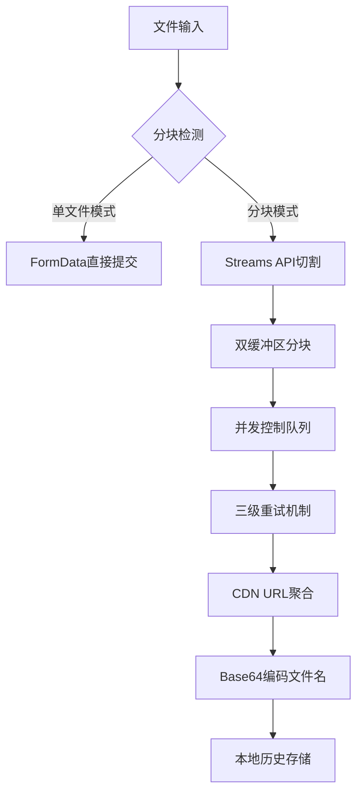

# FlowChunkFlex - 流式分块上传工具

[](https://www.gnu.org/licenses/gpl-3.0.html)
[](https://vuejs.org/)
[](https://vercel.com)
**English Version**: [README.md](./README.md)

> 专为绕过编程猫大文件限制设计的分块上传工具，保障文件传输可靠性（v5.2+）

---

## 🚀 核心功能升级（v5.2+）

### 技术增强
- **智能分块策略**：
  - 动态分块计算（最小1MB/最大15MB）
  - 小文件自动禁用分块（≤1MB）
  - 缓冲区流式切割（Uint8Array优化）
- **增强型并发控制**：
  - 并行上传限制（最大2个并发请求）
  - 动态请求频率控制（每秒≤5次）
- **可靠性优化**：
  - 分块超时重传（动态超时：5s~60s）
  - 三级重试机制（指数退避策略：1s/2s/4s）
  - 实时并发计数器（activeUploads状态追踪）
- **本地持久化**：
  - 操作日志支持分页存储（最大1000条）
  - 上传历史自动去重（基于链接哈希）

### 交互改进
- **状态监控增强**：
  - 分块进度实时显示（已提交块数/总块数）
  - 预估完成时间计算（基于历史上传速度）
- **组件化重构**：
  - 独立调试日志模块（支持清除/导出）
  - 历史记录表格支持暗黑模式
  - 主题切换动画优化（CSS变量过渡）

---

## 🛠️ 技术栈升级

| 模块                | 实现细节                                                                 |
|---------------------|--------------------------------------------------------------------------|
| **网络层**          | `AbortController` 信号中断 + 动态超时策略（基于分块大小）               |
| **文件处理**        | Streams API + Blob分段合并（浏览器内存优化）                            |
| **状态管理**        | Vue响应式系统 + localStorage持久化（自动JSON序列化）                    |
| **错误处理**        | 三级错误捕获（网络层/业务层/用户层）                                    |
| **构建优化**        | Vite 6 + 智能分包策略（vendor包自动分离）                               |

---

## 🖥️ 快速使用指南

### 部署方式
```bash
# 本地开发（热重载支持）
npm install
npm run dev

# 生产构建（PWA支持）
npm run build
```

### Vercel 一键部署
[](https://vercel.com/new/clone?repository-url=https://github.com/CJackHwang/FlowChunkFlex)

### 工作流程
1. **文件选择**：拖放区域支持Hover状态反馈（最大30MB）
2. **模式切换**：智能分块开关（文件>1MB自动启用）
3. **上传监控**：
   - 实时分块进度（`已提交 ${index}/${totalChunks} 块`）
   - 服务器响应耗时统计（调试日志可见）
4. **结果处理**：
   - 链接智能解析（兼容`[filename]chunk1,chunk2`格式）
   - 浏览器流式合并下载（自动拼接CDN路径）

---

## ⚙️ 核心配置参数

### 网络层配置（MainContent.vue）
```javascript
const UPLOAD_URL = 'https://api.pgaot.com/user/up_cat_file'; // 上传端点
const REQUEST_RATE_LIMIT = 5;  // 每秒最大请求数
const CONCURRENT_LIMIT = 2;    // 并行上传数（代码实际值）
const MAX_CHUNK_SIZE = 15 * 1024 * 1024; // 最大分块15MB
```

### 分块策略（MainContent.vue）
```javascript
// 动态超时计算（基于分块大小）
const dynamicTimeout = Math.max(5000, (chunk.size / (20 * 1024 * 1024)) * 60000);

// 缓冲区管理
let buffer = new Uint8Array(CHUNK_SIZE);
let bufferPos = 0; // 当前缓冲区写入位置
```

---

## 📊 系统架构（v5.2+）



---

## 🔒 合规与安全

1. **数据隐私**：
   - 所有操作记录仅存储于localStorage
   - 无第三方SDK嵌入（纯前端实现）
2. **内容审查**：
   - 文件上传遵循编程猫CDN审查策略
   - 违法内容自动屏蔽机制（服务器端实现）
3. **许可协议**：
   - GPL-3.0 开源协议（包含次级依赖）
   - 禁止商业闭源使用（编程猫接口不可商业使用）

---

## 🧩 组件说明（v5.2）

| 组件                | 功能特性                                  |
|---------------------|------------------------------------------|
| `DebugLogger.vue`   | 实时日志显示（时间戳+分隔符）            |
| `UploadHistory.vue` | 表格虚拟滚动（最大高度500px）            |
| `MainContent.vue`   | 核心处理器（流式切割+并发控制）          |
| `ThemeToggle.vue`   | 主题状态同步（自动检测系统主题）         |

---

## 🤝 贡献指南

1. **代码规范**：
   - 使用Vue3 `<script setup>` 语法
   - 响应式变量必须使用`ref`/`computed`
2. **测试要求**：
   - 分块逻辑需通过>100MB文件测试
   - 网络错误模拟测试（Chrome DevTools）
3. **文档更新**：
   - 修改配置参数需同步更新README
   - 新增组件需补充组件说明表

---

**开发者信息**  
CJackHwang · [GitHub](https://github.com/CJackHwang) · [技术博客](http://www.cjack.cfd)

> 重要提示：本工具仅用于技术研究，上传文件前请确保已获得合法授权