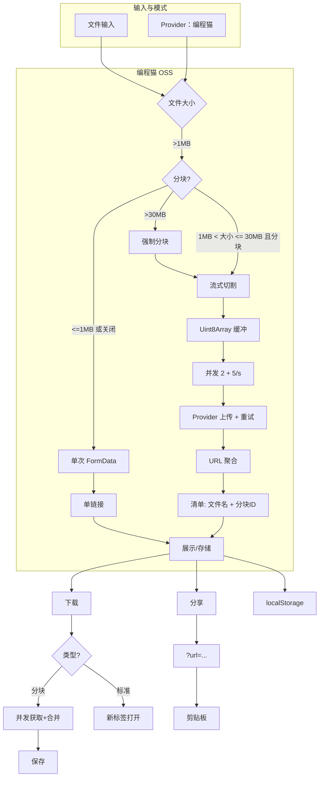

# Chunkuposs — 分块上传与分享 (v6.1.2)

[](https://www.gnu.org/licenses/gpl-3.0.html)
[](https://vuejs.org/)
[](https://vercel.com)
[](https://nodejs.org/)
[](https://www.npmjs.com/)
[](https://vitejs.dev/)
[](https://www.typescriptlang.org/)
中文 | English: [README.md](README.md)

Chunkuposs 采用 Provider 架构（默认编程猫 CodeMao），核心服务使用 TypeScript 实现。DangBei 集成已移除。
新增 WebDAV 管理器的外置预览容器（DavPreview）：预览卡片作为独立容器渲染在整个管理器下方，不受文件列表滚动影响。

## 6.0+ 更新要点
- Provider 注入式服务层完善（`StorageProvider` + `CodemaoProvider`）。
- 核心服务 TS 化（上传/分块/下载/toast/存储）。
- 编程猫模式下 >30 MB 强制分块；分块动态范围 1–15 MB。
- 流式切割 + 并发（上传并发 2 + ≤5 次/秒）。
- 下载并发（默认 4）与进度展示。
- ETA 更智能、动态超时、重试与详尽日志。
- 支持 `?url=...` 分享链接与页面自动解析；历史统一。
- Vite 7 + PWA 插件；支持 Vue DevTools 开发插件。

## 核心功能
- Provider 架构：`StorageProvider` 接口 + 默认 `CodemaoProvider`。
- TS 服务层：`uploadService.ts`、`chunkUploadService.ts`、`downloadService.ts`、`toast.ts`、`storageHelper.ts`。
- 智能分块：1–15 MB 动态；>30 MB 强制分块；流式切割。
- 并发与限流：上传并发 2 + ≤5 次/秒；下载并发 4（带进度条）。
- 可靠性：动态超时、重试、ETA 优化。
- 分享与历史：`?url=...` 分享链接，本地历史与日志统一。

## 技术栈
- UI 与样式：Vue 3、CSS 变量、Toastify.js、Material Design 3。
- 网络：`fetch` + `AbortController`；Provider 驱动端点。
- 文件处理：Streams API + Blob 合并（浏览器内存优化）。
- 状态：Vue 响应式（`ref`、`computed`）+ `localStorage` 持久化。
- 构建：Vite 7 + PWA 插件，vendor 拆分。

版本信息（当前）
- Vite 7.1.x、@vitejs/plugin-vue 6.0.x、vite-plugin-pwa 1.0.x
- Vue 3.5.x、TypeScript 5.9.x、vue-tsc 3.x
- ESLint 9.x、Oxlint 1.x

## 快速开始
- 开发：`npm install`，`npm run dev`
- 构建：`npm run build`
- 预览：`npm run preview`

### 运行要求
- Node.js ≥20（推荐 22）
- npm ≥10（或使用 pnpm/yarn；示例为 npm）
- 支持 Streams API 的现代浏览器
- 已在 `package.json` 的 `engines` 与 `packageManager` 字段声明运行环境

### 脚本说明
- `npm run dev`：启动 Vite 开发服务器
- `npm run dev:dav`：启动最小 WebDAV 原型服务器（Node >=20）
- `npm run build`：类型检查 + 构建（含 PWA）
- `npm run preview`：预览生产构建
- `npm run type-check`：`vue-tsc` 类型检查
- `npm run lint`：同时运行 ESLint 与 Oxlint
- `npm run lint:eslint`：仅 ESLint 修复
- `npm run lint:oxlint`：仅 Oxlint 修复

环境变量（`.env`/`.env.local`）：
```
VITE_UPLOAD_URL=https://api.pgaot.com/user/up_cat_file
VITE_REQUEST_RATE_LIMIT=5
VITE_CONCURRENT_LIMIT=2
VITE_MAX_CHUNK_MB=15
VITE_MIN_CHUNK_MB=1
VITE_FORCE_CHUNK_MB=30
VITE_BASE_DOWNLOAD_URL=https://static.codemao.cn/Chunkuposs/
VITE_FORM_UPLOAD_PATH=Chunkuposs
VITE_DOWNLOAD_CONCURRENT_LIMIT=4
```

说明：
- `VITE_FORCE_CHUNK_MB`：在编程猫模式下，大于该值强制启用分块上传。
- `VITE_BASE_DOWNLOAD_URL`：用于拼接分块下载 URL 的基础前缀。
- 所有变量均有默认值，见 `src/config/constants.js`。

Vercel 一键部署：
[](https://vercel.com/new/clone?repository-url=https://github.com/CJackHwang/Chunkuposs)

## 使用流程
- 选择文件 → 上传
- 监控进度（分块或单链接）
- 获取链接：分块格式 `[文件名]块1,块2,...` 或单链接 URL
- 下载：粘贴分块链接或标准 URL
- 分享：复制 `?url=...` 链接
 - 管理器：点击顶部“WebDAV 文件管理器”或访问 `#/dav`，在页面下方的独立预览容器中查看选中文件的链接与图片/音视频预览。

### 链接格式
- 单链接（≤1 MB 或手动选择单次上传）：`https://.../path/file.ext`
- 分块清单：`[文件名]id1,id2,id3`
  - 文件名使用 URL 编码；id 从上传响应中抽取。

## 配置与 Provider
- 核心常量：上传 URL、限速/并发、分块阈值、下载基础 URL、表单上传路径。
- Provider 层：
  - `src/providers/StorageProvider.ts`：`uploadSingle`、`uploadChunk`、`buildChunkManifest`、`getDownloadBase`
  - `src/providers/CodemaoProvider.ts`：默认编程猫实现

### 关键逻辑片段（MainContent.vue）
```
// >30MB 强制分块
if (uploadMode.value === 'codemao' && fileSize > THIRTY_MB_THRESHOLD) {
  isLargeFileSupport.value = true;
  isChunkCheckboxDisabled.value = true;
}

// 分享链接生成
const currentUrl = new URL(window.location.href);
currentUrl.search = '';
currentUrl.searchParams.set('url', encodeURIComponent(sjurl.value));
const shareUrl = currentUrl.toString();
```

## 架构


## 分块原理
- 通过 `ReadableStream` 读取文件并缓冲到 `Uint8Array` 分块。
- 上传并发限制为 2，另有全局 ≤5 次/秒的限速。
- 每个分块上传采用动态超时与指数退避重试。
- 成功后聚合分块 id 生成 `[filename]id1,id2,...` 清单。
- 下载按并发（默认 4）拉取所有分块，合并 Blob 后触发保存。

## 项目结构
- `src/components/MainContent.vue`：UI 状态与服务调用
- `src/services/*`：单/分块上传、下载、ETA、toast
- `src/providers/*`：Provider 接口与编程猫默认实现
- `src/config/constants.*`：运行时配置与环境覆盖
- `src/utils/*`：工具与 localStorage 管理
- `vite.config.ts`：Vite + PWA 配置
 - `src/components/WebDavManager.vue`：WebDAV 管理器（文件列表与操作）
 - `src/components/DavPreview.vue`：WebDAV 外置预览容器（固定在管理器下方）

## PWA
- 已配置 manifest（名称/图标/主题）；独立应用显示。
- 运行时缓存常见静态资源；开发环境开启 PWA 测试。

## 限制与说明
- 受上游服务策略影响；链接可能受限或过期。
- 超大文件取决于浏览器内存与网络稳定性。
- 禁止将非公开 API 用于商业用途。

## 安全与许可
- 数据隐私：日志与历史仅存储在浏览器 `localStorage`。
- 服务策略：上传遵循上游存储服务规则。
- 许可协议：GPL‑3.0；禁止将非公开 API 用于商业用途。

## 组件与服务
- 组件：`MainContent.vue`、`DebugLogger.vue`、`UploadHistory.vue`、`ThemeToggle.vue`。
- 服务（TS）：`uploadService.ts`、`chunkUploadService.ts`、`downloadService.ts`、`toast.ts`。
- 工具：`helpers.js`、`storageHelper.ts`。
- Provider：`StorageProvider.ts`、`CodemaoProvider.ts`、`providers/index.ts`。

## 贡献
- 遵循 Vue 3 `<script setup>` 约定；使用 `ref`/`computed`。
- 以不同文件大小测试（含 >100MB）；模拟慢网与错误。
- 配置或功能变更时同步更新文档。

## 路线图
- 见 `ROADMAP.md`（中英文同步）。
## 常见问题（FAQ）
- 为何 >30 MB 强制分块？提高可靠性，避免上游的单次上传限制。
- 如何新增 Provider？实现 `StorageProvider` 并在 `getDefaultProvider()` 中替换。
- 为什么使用清单格式？简洁且与 Provider 解耦；应用端负责还原下载 URL。
### WebDAV 原型环境
- `DAV_PORT`：服务器端口（默认 `8080`）
- `DAV_BASE_PATH`：挂载前缀（默认 `/dav`）
- `DAV_TOKEN`：可选的 Bearer Token 鉴权
- `DAV_RATE_RPS`：按 IP 的每秒请求数（默认 `20`）

当前原型将 `server/data` 作为本地挂载目录。为避免将数据库文件提交到仓库，已在 `.gitignore` 中忽略 `server/meta.db` 及其 `-wal`/`-shm` 等相关文件（同时忽略 `server/*.db*`）。后续版本会将 DAV 操作映射到 Provider 后端的分块清单与下载链接。
