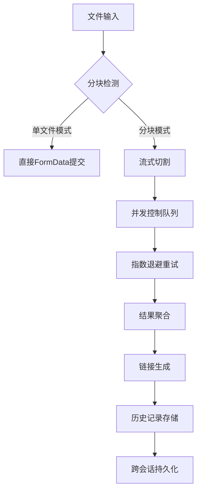

# FCD微型网盘 - 流式分块上传工具

[](https://www.gnu.org/licenses/gpl-3.0.html)
[](https://vuejs.org/)
[](https://vercel.com)
**English Version**: [README.md](./README.md)

> 专为绕过编程猫大文件限制设计的分块上传工具，保障文件传输可靠性

---

## 🚀 核心功能升级（v5.0+）

### 技术增强
- **智能分块策略**：
  - 动态分块计算（最小1MB/最大20MB）
  - 小文件自动禁用分块（≤1MB）
- **增强型并发控制**：
  - 并行上传限制（最大3个并发请求）
  - 动态请求频率控制（每秒≤5次）
- **可靠性优化**：
  - 分块超时重传（动态超时机制）
  - 错误恢复指数退避（1s/2s/4s）
- **本地持久化**：
  - 操作日志支持时间戳记录
  - 上传历史自动去重存储

### 交互改进
- **深度主题系统**：
  - 完整 Material Design 3 规范实现
  - 新增现代深色主题（支持CSS变量过渡动画）
- **状态监控增强**：
  - 实时并发上传计数显示
  - 服务器响应等待状态提示
- **组件化重构**：
  - 独立调试日志模块（`DebugLogger.vue`）
  - 历史记录表格支持暗影层级

---

## 🛠️ 技术栈升级

| 模块                | 实现细节                                                                 |
|---------------------|--------------------------------------------------------------------------|
| **主题系统**        | CSS变量驱动 + 无缝过渡动画（`darktheme.css`）                           |
| **网络层**          | AbortController信号中断 + 动态超时策略                                  |
| **文件处理**        | Streams API + Blob分段合并                                              |
| **状态管理**        | Vue响应式系统 + localStorage持久化                                      |
| **UI组件库**        | 自定义Material Design组件（开关/表格/按钮）                             |
| **构建优化**        | Vite 6 + will-change硬件加速声明                                        |

---

## 🖥️ 快速使用指南

### 部署方式
```bash
# 本地开发（热重载支持）
npm install
npm run dev
```
### Vercel 一键部署
[](https://vercel.com/new/clone?repository-url=https://github.com/CJackHwang/Fuck-Codemao-Detection)

### 工作流程
1. **文件选择**：拖放区域支持Hover状态反馈（`file-upload`组件）
2. **模式切换**：智能分块开关（`chunk-toggle`组件）
3. **上传监控**：
   - 实时分块进度（`已提交 ${index}/${totalChunks} 块`）
   - 服务器响应耗时统计
4. **结果处理**：
   - 链接智能解析（兼容新旧格式）
   - 浏览器流式合并下载

---

## ⚙️ 核心配置参数

### 网络层配置（MainContent.vue）
```javascript
const UPLOAD_URL = 'https://api.pgaot.com/user/up_cat_file'; // 上传端点
const REQUEST_RATE_LIMIT = 5; // 每秒最大请求数
const CONCURRENT_LIMIT = 3;   // 并行上传数
```

### 分块策略（MainContent.vue）
```javascript
// 动态超时计算（基于分块大小）
const dynamicTimeout = Math.max(5000, (chunk.size / (20 * 1024 * 1024)) * 60000);

// 最小分块阈值（强制单文件模式）
const MIN_CHUNK_SIZE = 1 * 1024 * 1024;
```

### 主题配置（ThemeToggle.vue）
```javascript
// 自适应主题逻辑
const systemDark = window.matchMedia('(prefers-color-scheme: dark)').matches;
this.isDarkMode = savedTheme ? savedTheme === 'dark' : systemDark;
```

---

## 📊 系统架构



---

## 🔒 合规与安全

1. **数据隐私**：
   - 所有操作记录仅存储于本地IndexedDB
   - 无第三方数据收集组件
2. **内容审查**：
   - 文件上传遵循编程猫CDN审查策略
   - 违法内容自动屏蔽机制
3. **许可协议**：
   - GPL-3.0 开源协议（包含次级依赖）
   - 禁止商业闭源使用

---

## 🧩 组件说明

| 组件                | 功能特性                                  |
|---------------------|------------------------------------------|
| `ThemeToggle.vue`   | 主题切换（SVG图标动态加载）              |
| `UploadHistory.vue` | 虚拟滚动表格（最大高度400px）            |
| `DebugLogger.vue`   | 日志分页显示（支持ANSI颜色码）           |
| `MainContent.vue`   | 文件流处理器（ReadableStream封装）       |

---

## 🤝 贡献指南

1. **开发规范**：
   - 遵循Vue3 Composition API规范
   - CSS变量前缀使用`--primary-*`/`--surface-*`
2. **测试要求**：
   - 新增功能需包含Vitest用例
   - UI变更需通过Storybook验证
3. **问题反馈**：
   - 使用GitHub Issues模板
   - 附带浏览器控制台日志

---

**开发者信息**  
CJackHwang · [GitHub](https://github.com/CJackHwang) · [技术博客](http://www.cjack.cfd)

> 重要提示：本工具仅用于技术研究，请遵守目标平台的使用政策
